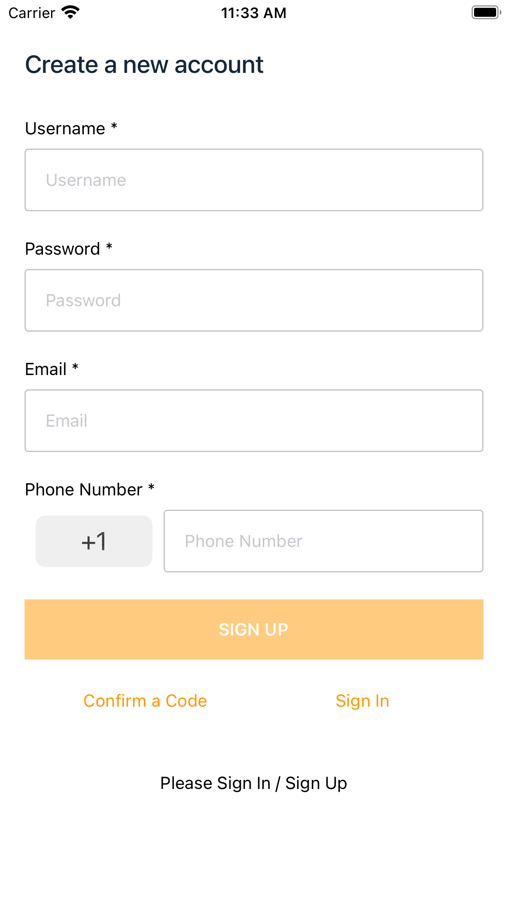
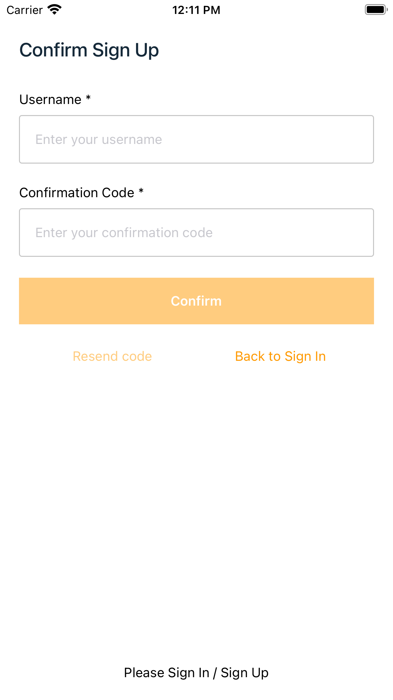
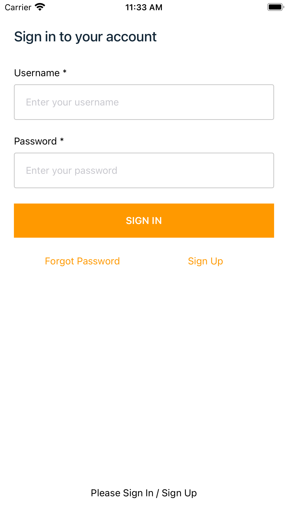
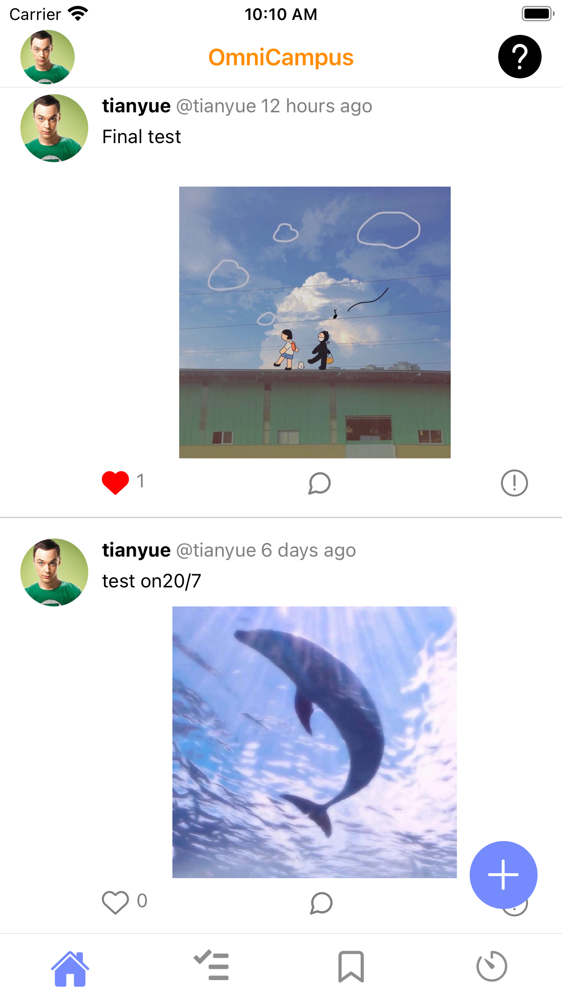
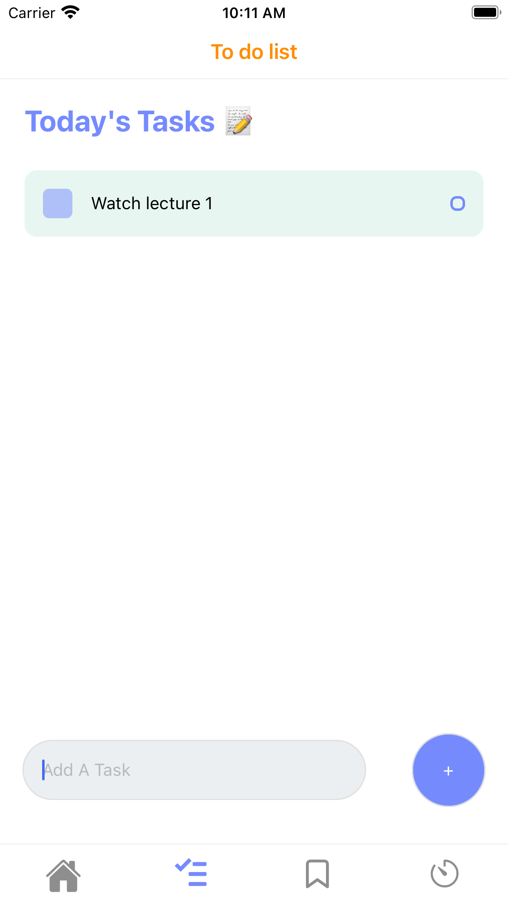
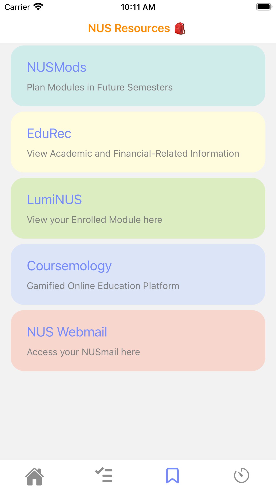
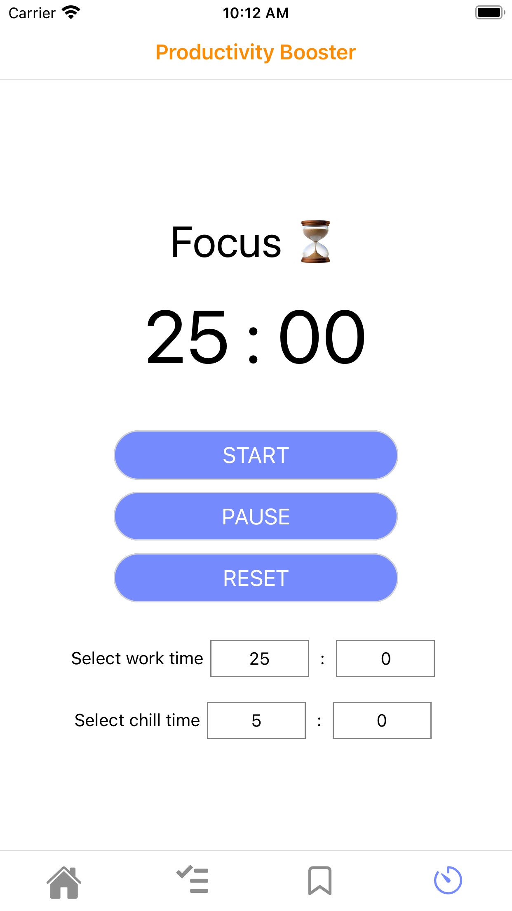

# OmniCampus
<!-- PROJECT LOGO -->
<br />
<p align="center">
  <a href="https://github.com/tianyue58/OmniCampus-Final">
    
  </a>
 

  <h3 align="center">OMNICAMPUS</h3>

  <p align="center">
    A social networking mobile app developed for NUS community!
    <br />
    <a href="https://github.com/tianyue58/OmniCampus-Final#readme"><strong>Explore the docs »</strong></a>
    <br />
    <br />
    <a href="https://github.com/tianyue58/OmniCampus-Final/edit/master/README.md#demo">View Demo</a>
    ·
    <a href="https://github.com/tianyue58/OmniCampus-Final/issues">Report Bug</a>
    ·
    <a href="https://github.com/tianyue58/OmniCampus-Final/issues">Request Feature</a>
  </p>
</p>

<!-- TABLE OF CONTENTS -->
<details open="open">
  <summary><h2 style="display: inline-block">Table of Contents</h2></summary>
  <ol>
    <li>
      <a href="#about-the-project">About The Project</a>
      <ul>
        <li><a href="#built-with">Built With</a></li>
      </ul>
    </li>
    <li>
      <a href="#getting-started">Getting Started</a>
      <ul>
        <li><a href="#prerequisites">Prerequisites</a></li>
        <li><a href="#installation">Installation</a></li>
      </ul>
    </li>
    <li>
      <a href="#usage">Usage</a>
      <ul>
        <li><a href="#features">Features</a></li>
        <li><a href="#demo">Demo</a></li>
      </ul>
    </li>
    <li><a href="#roadmap">Roadmap</a></li>
    <li><a href="#contact">Contact</a></li>
  </ol>
</details>

<!-- ABOUT THE PROJECT -->
## About The Project

Currently, there are a lot of different sources of information for NUS students about campus life, be it emails about school activities or academic platforms such as NusMods. However, it is tiring to keep track of all the information from all those different sources and sometimes students may forget about certain key information.

Instead of letting students gather information about their module information and various school activities bit by bit, OmniCampus provides a collective information hub for students and staff to interact and post things about campus life on a social media app?
Posts may be realated to sections such as module information and campus activity promotions. All users of the app can make a post or access their desired information.

Additionally, this app is made more relevant to NUS student community by having features to boost productivity such as to-do-list and pomodoro technique. 

Furthermore, OmniCampus offers easy access to NUS resources by providing a resource compilation page. This allows a centralised system to quickly navigate to different school resources.

### Built With

This section should list any major frameworks that you built your project using. Leave any add-ons/plugins for the acknowledgements section. Here are a few examples.
* [React Native](https://reactnative.dev)
* [Expo](https://docs.expo.io)
* [TypeScript](https://www.typescriptlang.org)
* [Aws Amplify](https://aws.amazon.com/amplify/)

<!-- GETTING STARTED -->
## Getting Started

This is an example of how you may give instructions on setting up your project locally.
To get a local copy up and running follow these simple example steps.

### Prerequisites

This is an example of how to list things you need to use the software and how to install them.
* npm
  ```sh
  npm install npm@latest -g

### Installation

* Confirgure Aws Amplify following the steps in 'https://docs.amplify.aws/start/getting-started/installation/q/integration/react-native'.
* Initialise the project by running `amplify init -app https://github.com/tianyue58/Orbital_Team_Runtime_Error`
* Make sure you have expo-cli installed. If not run `npm install -g expo-cli`
* Run `npm start`
* Then type in terminal `a` to run on android emulator, `i` to run on ios simulator, or download Expo app on mobile and scan the QR code.
* Sign up to OmniCampus and try posting something.

<!-- USAGE EXAMPLES -->
## Usage

Check out the example of how this project can be used. 

### Features

* Authentication using email and password.
* Create posts with text & image.
* Like / Unlike posts.
* Report inappropriate posts.
* To-do lists to plan your day.
* Resource compilation page to easily access NUS resources.
* Pomodoro timer to boost productivity

### Demo

<div align="center">

<h4 align="center">Signup Screen (aws default) &nbsp&nbsp&nbsp&nbsp | &nbsp&nbsp&nbsp&nbsp Confirm Signup Screen (aws default)  &nbsp&nbsp&nbsp&nbsp | &nbsp&nbsp&nbsp&nbsp Signin Screen (aws default) </h4>


 


<h4 align="center">User Home Screen &nbsp&nbsp&nbsp&nbsp | &nbsp&nbsp&nbsp&nbsp New Post Screen</h4>



<h4 align="center">To-do-list Screen &nbsp&nbsp&nbsp&nbsp | &nbsp&nbsp&nbsp&nbsp Resource Screen &nbsp&nbsp&nbsp&nbsp | &nbsp&nbsp&nbsp&nbsp Timer Screen</h4>





</div>


<!-- ROADMAP -->
## Roadmap

See the [open issues](https://github.com/tianyue58/OmniCampus-Final/issues) for a list of proposed features (and known issues).

<!-- CONTACT -->
## Contact

Qu Tianyue - qutianyue58@gmail.com

Lu Yan Yang - luyanyang1@gmail.com

Project Link: [https://github.com/tainyue58/OmniCampus-Final](https://github.com/tainyue58/OmniCampus-Final)
